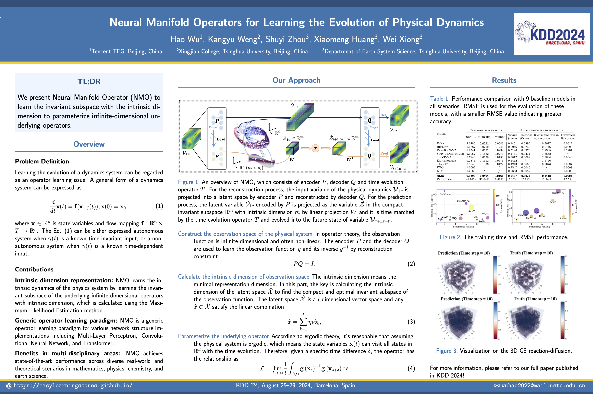

# Neural Manifold Operators

  

## Performance comparison with 9 baseline models in all scenarios

**RMSE** is used for the evaluation of these models, with a smaller RMSE value indicating greater accuracy. Since FNO is designed for single variables prediction, we only evaluate these models in single variables scenarios to ensure optimal performance of the baseline models. The underline indicates the most accurate result in baseline models. The bold font indicates the most accurate of all models. The asterisk (*) denotes GPU memory overflow (exceeding 40GB). The forward slash (/) indicates that the original model is only designed for single variable prediction.

| Model             | SEVIR | kuroshio | Typhoon | Navier Stokes | Shallow Water | Rayleigh-Bénard convection | Diffusion Reaction |
|-------------------|-------|----------|---------|---------------|---------------|-----------------------------|---------------------|
| U-Net             | 2.0280| 0.0591   | 0.0546  | 0.4451        | 0.0890        | 0.3977                      | 0.0612              |
| ResNet            | 2.0787| 0.0709   | 0.1246  | 0.5246        | 0.0730        | 0.5746                      | 0.0820              |
| PredRNN-V2        | 1.9741| 0.0651   | 0.0234  | 0.5196        | 0.0970        | 2.2965                      | 0.1201              |
| Swin-Transformer  | 2.0067| 0.1682   | 0.0273  | 0.4741        | 0.0434        | 1.6852                      | *                   |
| SimVP-V2          | 0.7943| 0.0658   | 0.0193  | 0.3872        | 0.0098        | 2.3804                      | 0.0043              |
| Earthformer       | 0.2877| 0.1612   | 0.0671  | 0.4472        | *             | 1.5746                      | *                   |
| TF-Net            | 2.1946| 0.1033   | 0.0172  | 0.4243        | 0.0860        | 0.2076                      | 0.0037              |
| FNO               | 1.0099| /        | /       | 0.2547        | 0.0045        | /                           | 0.0008              |
| LSM               | 1.2569| /        | /       | 0.2863        | 0.0087        | /                           | 0.0009              |
| **NMO**           | **0.1698**| **0.0404** | **0.0161** | **0.2487** | **0.0028** | **0.1418** | **0.0007**     |
| Promotion         | 41.01% | 31.64%   | 6.40%   | 2.35%         | 37.78%        | 31.74%                      | 12.5%               |

