# Neural-Manifold-Operator experimental records

## Baseline

## Neural Manifold Operator’s main table

| Model       |            | Real-world scenario |            |               |               | Equation-governed scenario |                    |      |
| ----------- | :--------: | :-----------------: | :--------: | :-----------: | :-----------: | :------------------------: | :----------------: | :--: |
|             |   SEVIR    |      kuroshio       |  Typhoon   | Navier Stokes | Shallow Water | Rayleigh-Bénard convection | Diffusion Reaction |      |
| U-Net       |   0.0235   |       0.0531        |   0.0051   |   0.4451966   |     0.086     |           0.0079           |       0.0065       |      |
| ResNet      |   0.0262   |       0.0843        |   0.0233   |   0.5246904   |     0.073     |           0.0391           |       0.0120       |      |
| PredRNNV2   |            |                     |            |   0.5196152   |     0.097     |                            |                    |      |
| Swin        |   0.0283   |       0.0819        |   0.0170   |   0.4741308   |   0.0434056   |           0.0270           |       0.0109       |      |
| SimVP-V2    |   0.0283   |       0.0819        |   0.0170   |   0.3872983   |    0.00987    |           0.0270           |       0.0109       |      |
| Earthformer |   0.0965   |       0.0900        |   0.0135   |   0.4472136   |       \       |           0.0385           |       0.0097       |      |
| TF-Net      |   0.0229   |       0.0508        |   0.0074   |   0.4243819   |     0.089     |           0.0138           |       0.0067       |      |
| FNO         |   0.0239   |       0.0480        |   0.0039   |   0.2547766   |   0.0041796   |           0.0269           |       0.0056       |      |
| LSM         |   0.0239   |       0.0480        |   0.0039   |   0.2863506   |   0.0087372   |           0.0269           |       0.0056       |      |
| **NMO**     | **0.0218** |     **0.0408**      | **0.0025** | **0.2487971** |   0.0028167   |       **0.1418381**        |     **0.0050**     |      |
| Promotion   |    4.8%    |        13.0%        |   26.5%    |     2.40%     |     15.6%     |            9.2%            |       10.7%        |      |

## Real-world  scenario
The real-world scenario includes four datasets: SEVIR, Kuroshio, Typhoon, and ERA5.

### SEVIR

### Kuroshio
The figure shows the training process curve and visualization, using [5, 2, 128, 128] prediction [15, 2, 128, 128]

### Typhoon

### ERA5

## Equation-governed scenario

### 2D Navier-Stokes equation(v=10e-5)

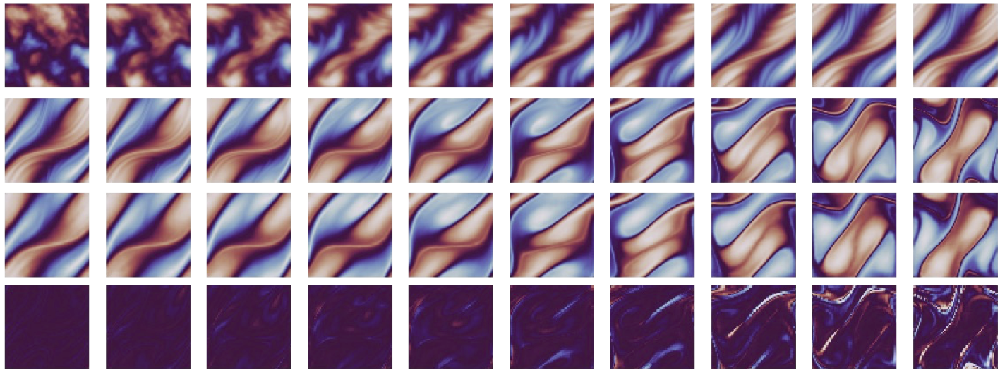

  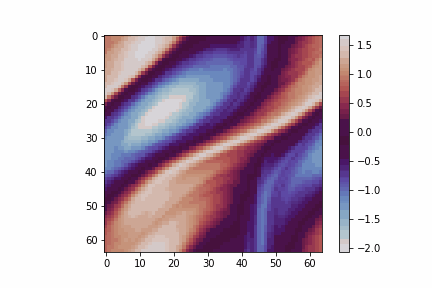
  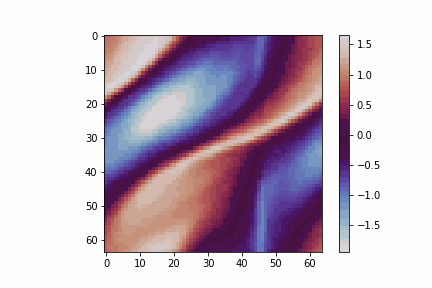

| Model | MSE              |
|-------|-----------------|
| NMO   | 6.238341e-02     |
| FNO   | 6.4911097e-02    |
| LSM   | 8.1996672e-02    |

NMO   MSE: 2.355240894758026e-06

| ID   | RMSE     |
|----------|----------|
| 2        | 0.2631   |
| 4        | 0.2498   |
| 6        | 0.2593   |
| 16       | 0.2677   |
| 32       | 0.2655   |
| 64       | 0.2802   |
| 128      | 0.2804   |
| 256      | 0.2720   |
| 512      | 0.3338   |
| 768      | 0.3527   |

### 2D Shallow-water equation
The figure shows the training process curve and visualization, using [10, 1, 128, 128] prediction [90, 1, 128, 128]
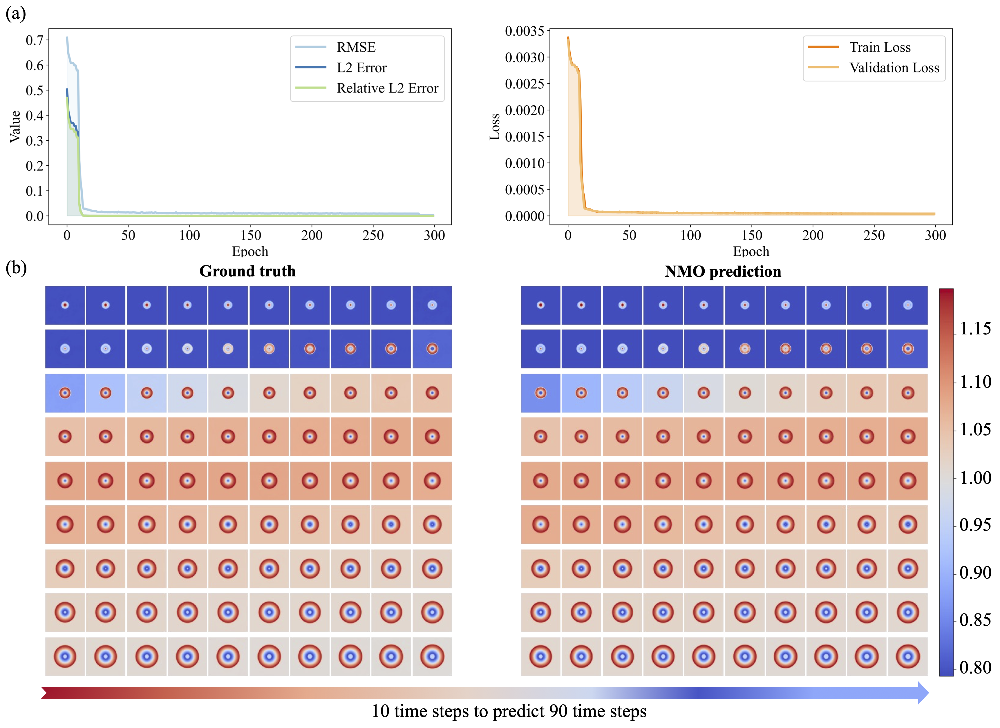

50 -> 50

  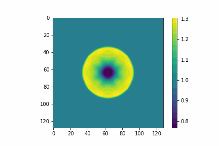
  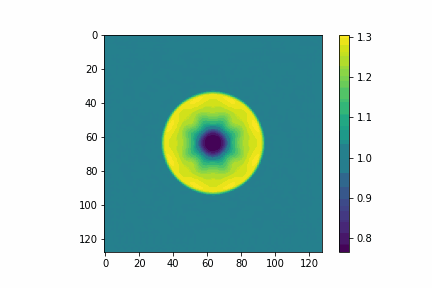

10 -> 90

  
  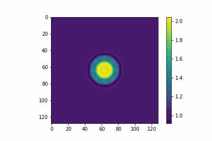

### (1). Input_frames, output_frames: torch.Size([50, 1, 128, 128])  torch.Size([50, 1, 128, 128])

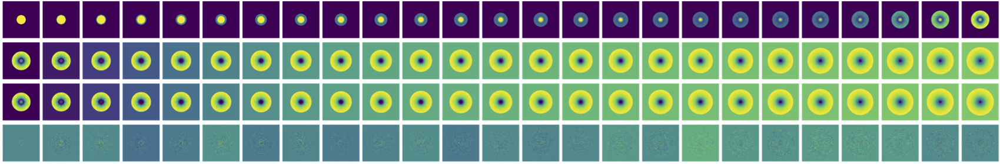

### (2). Input_frames, output_frames: torch.Size([10, 1, 128, 128])  torch.Size([90, 1, 128, 128])

2023-07-10 09:38:04,765 - RMSE: 0.00897868, L2 error: 0.00008062, Relative L2 error: 0.00007516
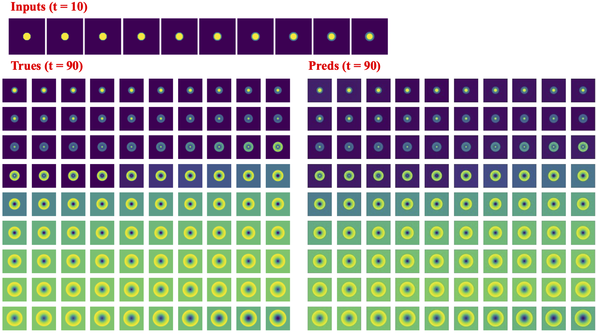

### Rayleigh-Bénard convection

10 -> 60

  
  

### 2D diffusion-reaction
### (1). Input_frames, output_frames: torch.Size([50, 2, 128, 128])  torch.Size([50, 2, 128, 128])

  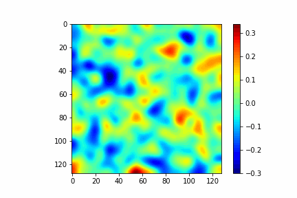
  

2023-07-11 15:24:08,395 - RMSE: 0.00077238, L2 error: 0.00000060, Relative L2 error: 0.00005127,

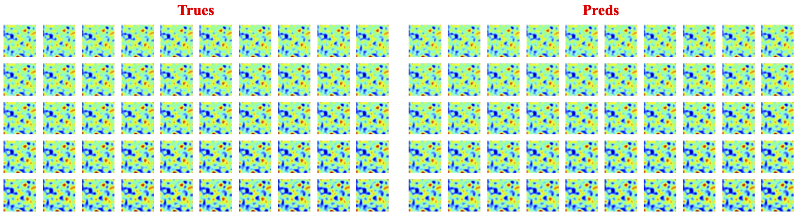

